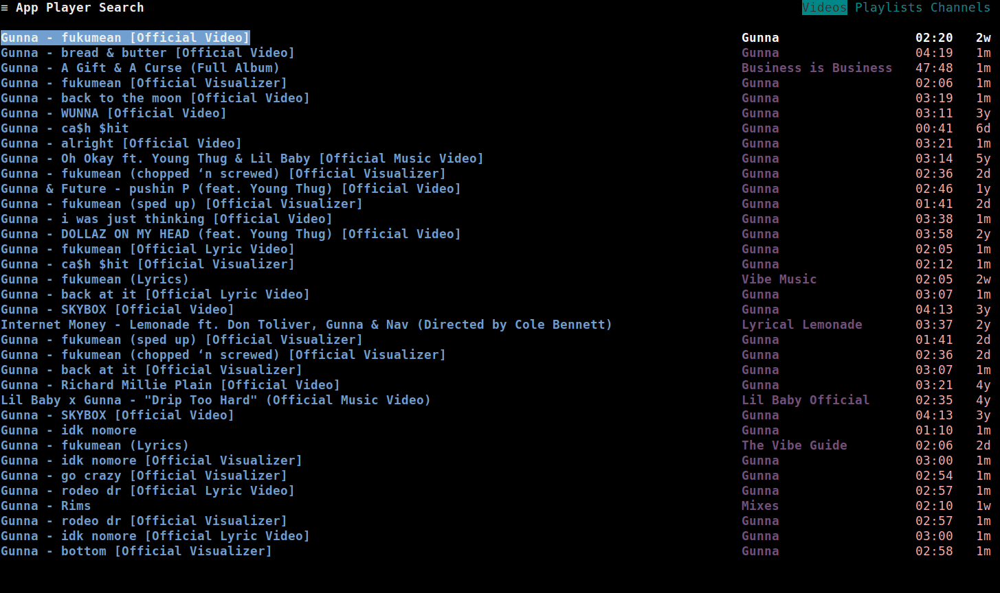
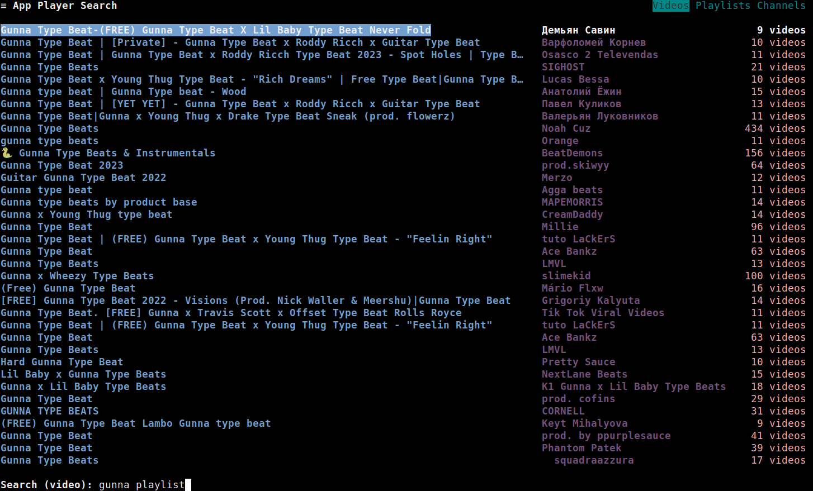

All the search results for your search query will be displayed in this page.

To fetch more results, press <kbd>`Enter`</kbd>.

To search for another query, press <kbd>`/`</kbd>.
The search input will be shown, where you can type your query and press <kbd>`Enter`</kbd> to load the results.

You can load/play audio and video, view links and more from this screen. Open the context menu to view the available operations.

# Search Input

The search input area has the following operations:
- Navigating search history
- Getting Suggestions
- Switching Search Modes
- Setting Search Parameters

Ensure that you are in the search input area before performing these operations.
To close the search input, press <kbd>`Escape`</kbd>.

## History
To move back/forward in the search history, press <kbd>`Up`</kbd>/<kbd>`Down`</kbd>, like so:

## Suggestions
To get suggestions for your search query, press <kbd>`Tab`</kbd>. A popup should be shown, like so:

To:
- Move up/down the search suggestions, press <kbd>`Ctrl`</kbd>+<kbd>`Up`</kbd>/<kbd>`Ctrl`</kbd>+<kbd>`Down`</kbd>
- Select a suggestion, press <kbd>`Enter`</kbd>
- Close the popup, press <kbd>`Escape`</kbd>

!!! note "Note"
	While moving through the search suggestions, the search input area will be auto-filled based on which result is selected.

As demonstrated in this GIF:

## Modes
There are three search modes:
- **Videos**
- **Playlists**
- **Channels**

Search modes are a way to search for a particular type of result.
For example, to search for videos you would select the **Videos** mode,
for playlists the **Playlists** mode and for channels the **Channels** mode.

To: 
- Switch search modes, press <kbd>`Ctrl`</kbd>+<kbd>`e`</kbd>
- Search for your query within the selected mode, press <kbd>`Enter`</kbd>

As demonstrated in this GIF:

## Parameters
To set search parameters press the <kbd>`Alt`</kbd>+<kbd>`e`</kbd>. A popup should be shown, like so:

To:
- Switch between the parameters one field forward, press <kbd>`Tab`</kbd>, or press <kbd>`Shift`</kbd>+<kbd>`Tab`</kbd> to switch one field backward. 
	- The **Sort By**, **Duration** and **Date** fields are dropdown lists, press <kbd>`Enter`</kbd> to show the dropdown list, press <kbd>`Up`</kbd>/<kbd>`Down`</kbd> to move up/down the dropdown list, and press <kbd>`Enter`</kbd> to select the option.
	- The **Region** field is an inputbox, which accepts a ISO 3166 country code (default is **US**).
	- The rest of the fields are checkboxes, which can be checked/unchecked to set the search features. Press <kbd>`Enter`</kbd> to toggle the selection.

- To set the search parameters, either navigate to the "Set" button by pressing <kbd>`Tab`</kbd> and press <kbd>`Enter`</kbd>, or press <kbd>`Alt`</kbd>+<kbd>`e`</kbd>.
- Close the popup, press <kbd>`Escape`</kbd>

As demonstrated in this GIF:

