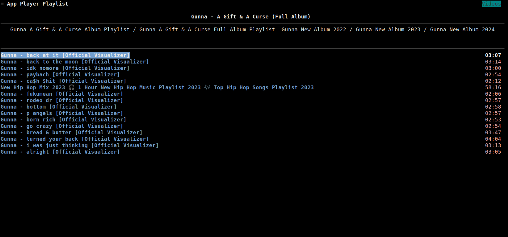
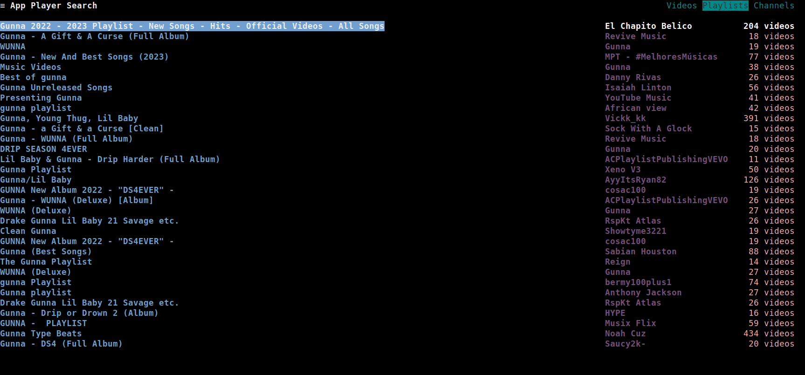

To open and view a playlist, press <kbd>`i`</kbd>.

The playlist page only shows the **Videos** associated with the selected playlist entry.

Then, the common operations can be done on this page, either by using the context menu or by using the [common keybindings](../03_Usage/02_Keybindings/01_Global_Keybindings.md#common).
