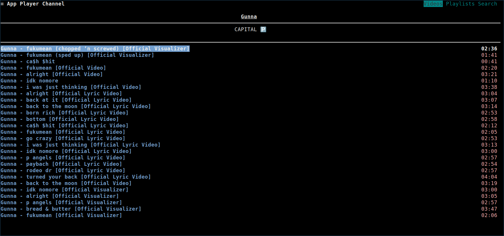
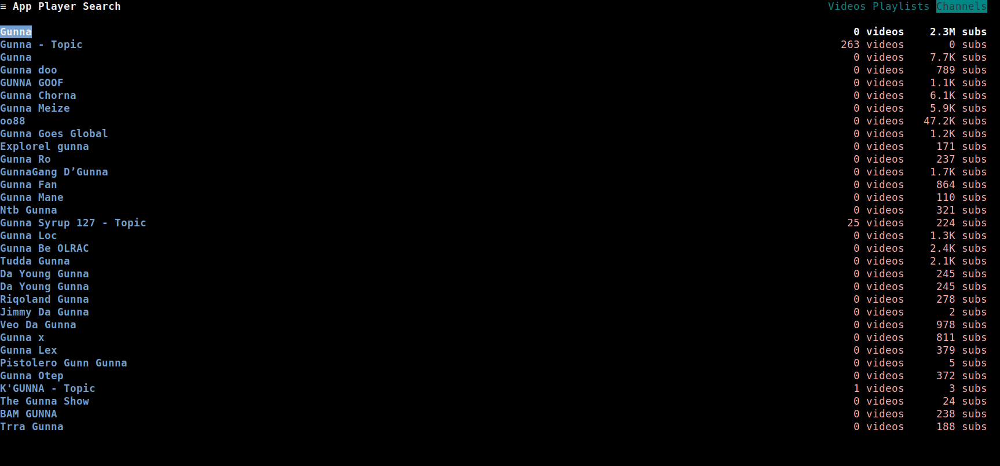
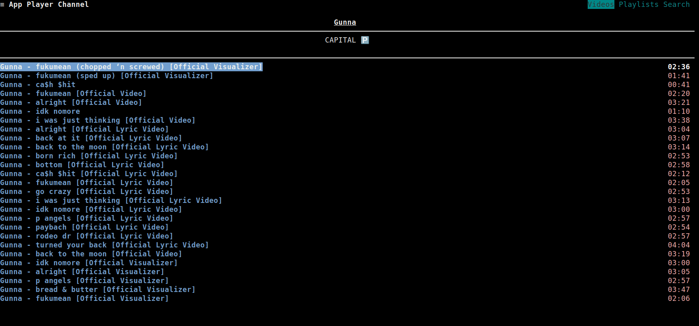

A channel page consists of three sub-pages:
- **Videos**
- **Playlists**
- **Search**

Generally, to open and view a channel, press <kbd>`u`</kbd>. 
The channel page should open up and display its **Videos**.

Optionally, to directly view the channel's **Playlists**, press <kbd>`Shift`</kbd>+<kbd>`u`</kbd>.

Once the channel page is opened, you can switch between tabs by pressing <kbd>`Tab`</kbd>.

To search for videos or playlists within a channel, navigate to the **Search** tab.
Then, press <kbd>`/`</kbd>. The search input should be shown. After typing your search query,
press <kbd>`Enter`</kbd> to load the search results.

The common operations can be done across all tabs, either by using the context menu or by using the [common keybindings](../03_Usage/02_Keybindings/01_Global_Keybindings.md#common).
