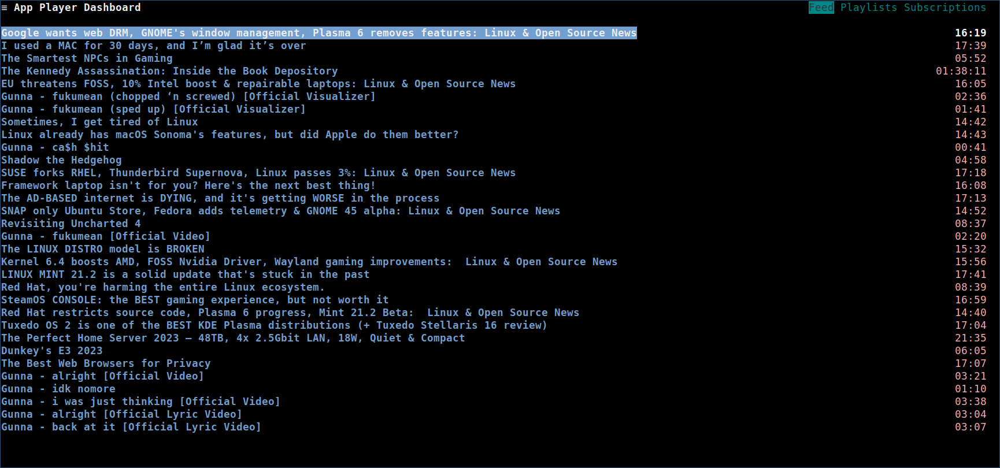
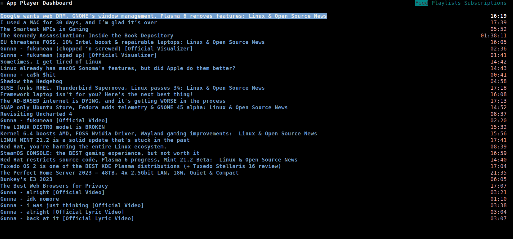
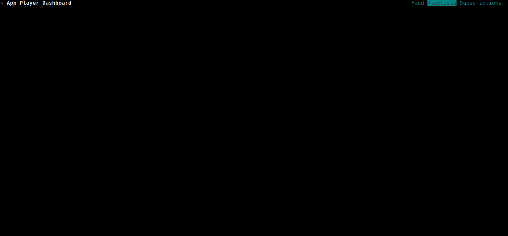
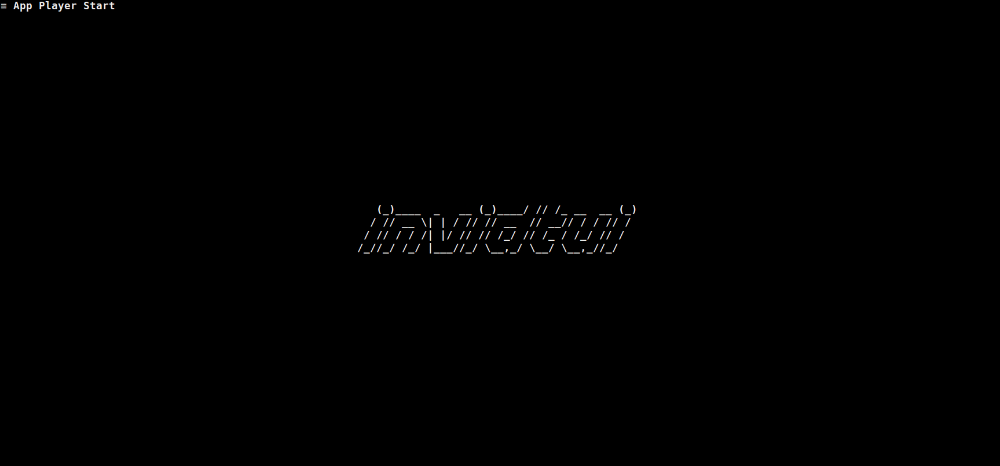
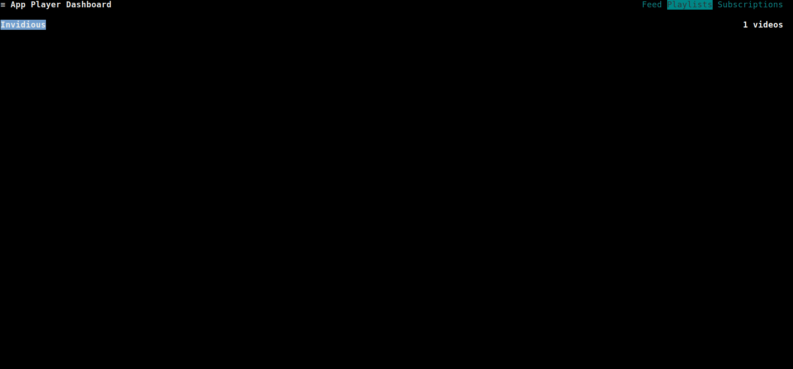
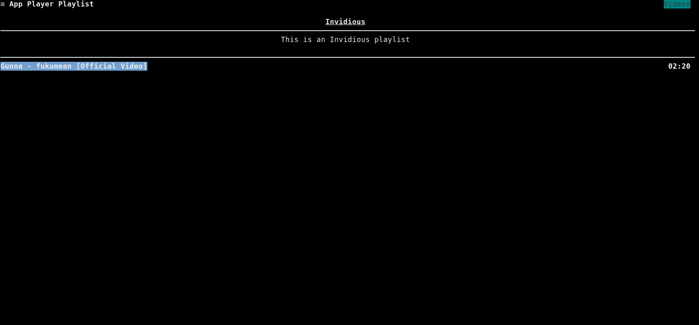
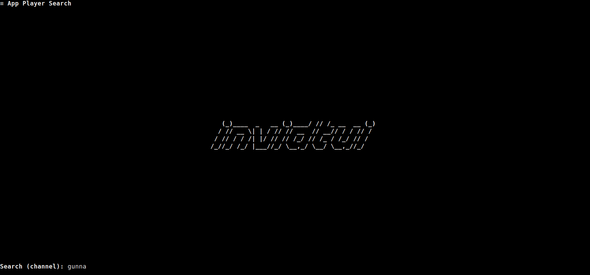
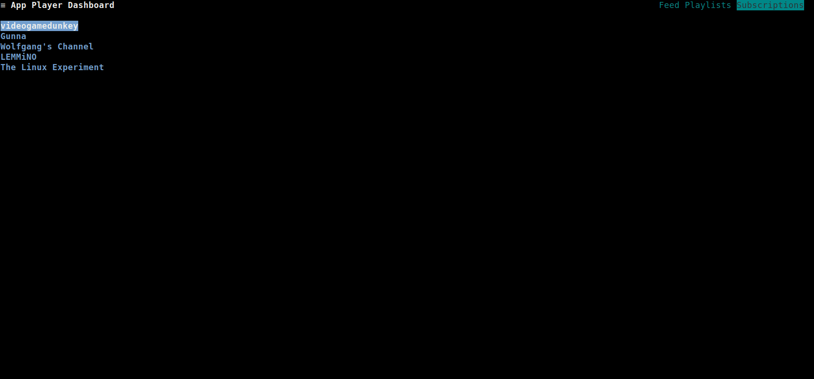

[TOC]

The dashboard displays all the feeds, playlists and subscriptions associated
with an authenticated Invidious account.

If the user is not authenticated, follow the [authentication](../05_Authentication.md) steps before
accessing the dashboard.

The dashboard page consists of three sub-pages:
- **Feed**
- **Playlists**
- **Subscriptions**

To open the dashboard, press <kbd>`Ctrl`</kbd>+<kbd>`d`</kbd>. The dashboard will load the user's feeds and display them.

To switch between tabs, press <kbd>`Tab`</kbd>.

# Feed
When the dashboard is opened, the feed is loaded.

You can load/play audio and video from this sub-page either by using the context menu or the [common keybindings](../03_Usage/02_Keybindings/01_Global_Keybindings.md#common).

# Playlists
To view a user's playlists, navigate to the **Playlists** tab. The playlists will be loaded and displayed.

## Creating a playlist
To create a playlist, press <kbd>`c`</kbd>.
A popup will be shown, where you can specify the *name* and visibility of the playlist.

To:
- Move between fields, press <kbd>`Tab`</kbd>
- Save and create a playlist, navigate to the "Save" button, and press <kbd>`Enter`</kbd>

As demonstrated in this GIF:

## Editing a playlist
To edit a playlist, press <kbd>`e`</kbd>.
A popup will be shown, where you can specify the name, description and visibility of the playlist.

To:
- Move between fields, press <kbd>`Tab`</kbd>
- Save the edits to the playlist, navigate to the "Save" button, and press <kbd>`Enter`</kbd>

As demonstrated in this GIF:

## Add playlist video
To add a video to a playlist:

- First, go to any page that has videos listed (for example, the Search page)
- Then, move the selector to the video you want to add using <kbd>`Up`</kbd>/<kbd>`Down`</kbd>
- Press <kbd>`+`</kbd> to add the selected video, a popup will be shown with your playlists
- Move to the playlist you wish to save the video to and press <kbd>`Enter`</kbd>

As demonstrated in this GIF:

## Remove playlist video
To remove a video from the playlist:

- First, open the playlist by pressing <kbd>`i`</kbd>
- Then, move the selector to the video you want to delete using <kbd>`Up`</kbd>/<kbd>`Down`</kbd>
- Finally, press <kbd>`_`</kbd>(underscore) to delete the video

As demonstrated in this GIF:

## Viewing a playlist
To view a playlist:

- First, move the selector to the playlist you want to view using <kbd>`Up`</kbd>/<kbd>`Down`</kbd>
- Then, press <kbd>`i`</kbd> to view the playlist

As demonstrated in this GIF:

## Deleting a playlist
To delete a playlist from the user's account:

- First, move the selector to the playlist you want to delete using <kbd>`Up`</kbd>/<kbd>`Down`</kbd>
- Then, press <kbd>`_`</kbd>(underscore) to delete the video

As demonstrated in this GIF:

# Subscriptions
To view a user's subscriptions, navigate to the **Subscriptions** tab. The subscriptions will be loaded and displayed.

## Subscribing to a channel
To subscribe to a channel:

- First, go to any page that has channels listed (for example, the Search page)
- Then, move the selector to the channel you want to subscribe to using <kbd>`Up`</kbd>/<kbd>`Down`</kbd>
- Press <kbd>`+`</kbd> to subscribe the selected video

As demonstrated in this GIF:

## Unsubscribing from a channel
To unsubscribe from a channel:

- First, move the selector to the channel you want to unsubscribe from using <kbd>`Up`</kbd>/<kbd>`Down`</kbd>
- Then, press <kbd>`_`</kbd>(underscore) to unsubscribe from the channel

As demonstrated in this GIF:

## Viewing a subscription
To view the subscribed channel:

- First, move the selector to the channel you want to view using <kbd>`Up`</kbd>/<kbd>`Down`</kbd>
- Then, press <kbd>`u`</kbd> to view the channel

Refer to the [channel](../04_Pages/04_Channel.md) keybindings.

As demonstrated in this GIF:

