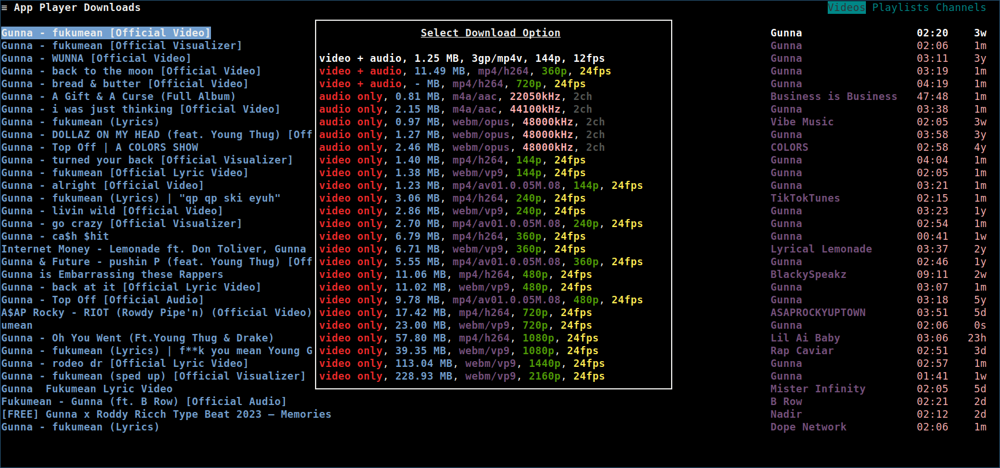
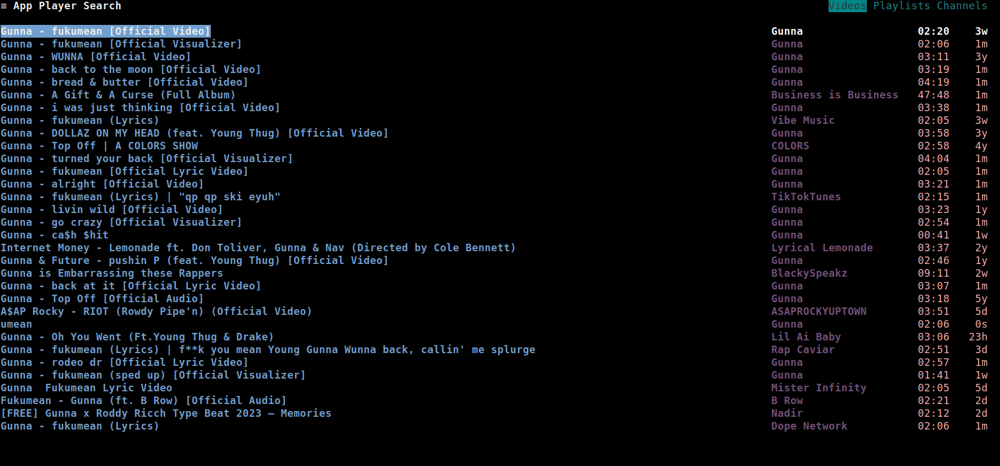
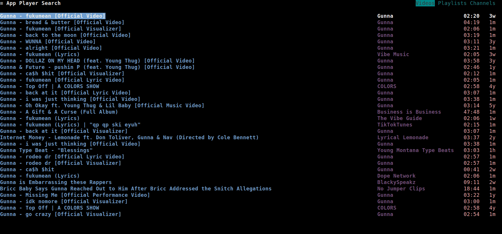
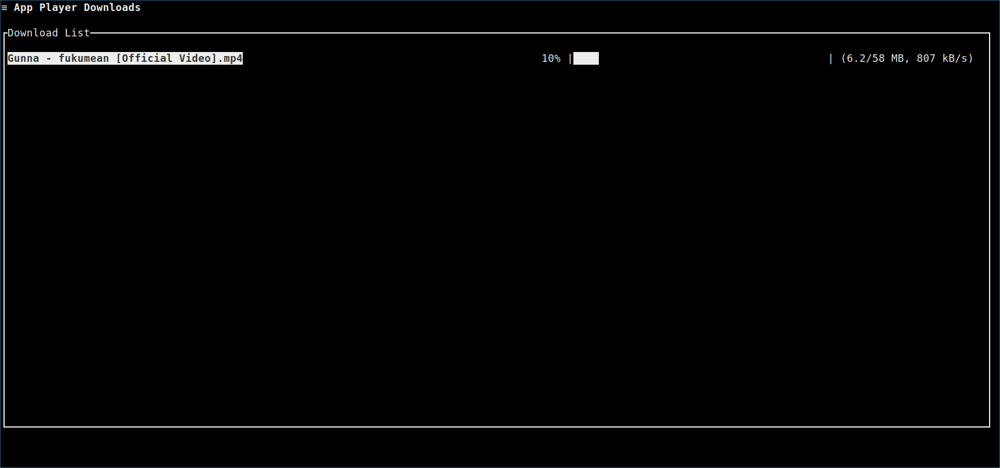

[TOC]

# Downloading a video

To download a video from wherever videos are listed, like the search results, or the playlist or channel pages, press <kbd>`y`</kbd>. If the [download-dir](../03_Usage/01_Command_Line_Options.md#download-dir) option is not configured, a [file browser](#configuring-the-download-directory) is shown to interactively select the download directory.

A popup will be shown, where you can view the download options for the video.
Press <kbd>`Enter`</kbd> to download the video in the selected format.

As demonstrated in this GIF:

# Configuring the download directory
If the download directory has to be changed, press <kbd>`Alt`</kbd>+<kbd>`Shift`</kbd>+<kbd>`y`</kbd> when the download options are displayed.
A filebrowser will be shown, where you can select the directory to download the video into.

To:
- Navigate forward/back directories, press <kbd>`Right`</kbd>/<kbd>`Left`</kbd>
- Select the download directory, press <kbd>`Enter`</kbd>

As demonstrated in this GIF:

# Viewing/Cancelling downloads

To view the currently running downloads, press <kbd>`Shift`</kbd>+<kbd>`y`</kbd>.
The downloads page should be shown, where you can view the download progress.

To cancel a download:
- First, move the selector to the download you want to cancel using <kbd>`Up`</kbd>/<kbd>`Down`</kbd>
- Then, press <kbd>`x`</kbd> to cancel the download

As demonstrated in this GIF:

