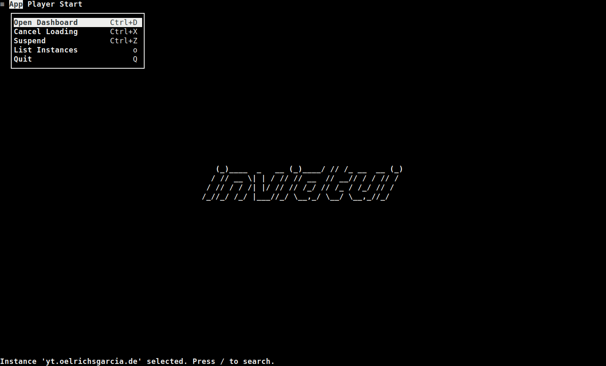

Generally, within the UI, you can navigate using the menu, if you are new to invidtui and find the keybindings cumbersome.

Except for a select few options, like the player controls (you will need to refer to the [player]() keybindings), the menu contains
all the options required to navigate within the app.

Once you are familiar enough with the application, you can use the keybindings, or even [configure](../02_Configuration.md) them according to your preferences.

!!! warning "Keybindings" 
	The keybindings described in the [Menu](../04_Pages/_index.md#Menu) section and the **Pages** subsections assume that you have not modified the default keybindings.
	If it is modified, use the appropriate keybinding type in place of the keybindings mentioned within the section.
	
!!! info "Common Operations"
	For all the pages, the menu and [common](../03_Usage/02_Keybindings/01_Global_Keybindings.md#common) keybindings apply, in addition to the page's keybindings.

# Menu
The menu is available throughout the application.

To use the menu within the application, press <kbd>`Alt`</kbd>+<kbd>`m`</kbd>.
A popup will be displayed on the top of the screen, like so:

The menubar consists of three menu types:
- App
- Player
- Context

The *App* and *Player* keybindings are permanent throughout the application, and provide options to control the *application* and *player* respectively.

The *Context* menu will change depending on the screen displayed. In the screenshot above, the context menu is named "*Start*", since it is in the [start](../04_Pages/01_Start.md) page. As pages change, so will the context menu and its options change.

To:
- Switch between menu items, press the <kbd>`Tab`</kbd> key,
- Select a menu item, press the <kbd>`Enter`</kbd> key,
- Close the menu popup, press the <kbd>`Escape`</kbd> key,

As demonstrated in this GIF:

