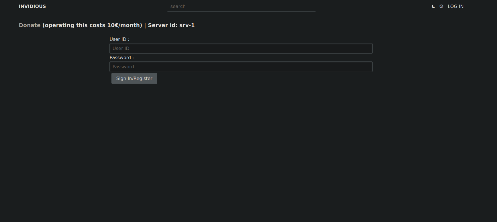
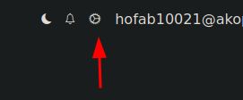
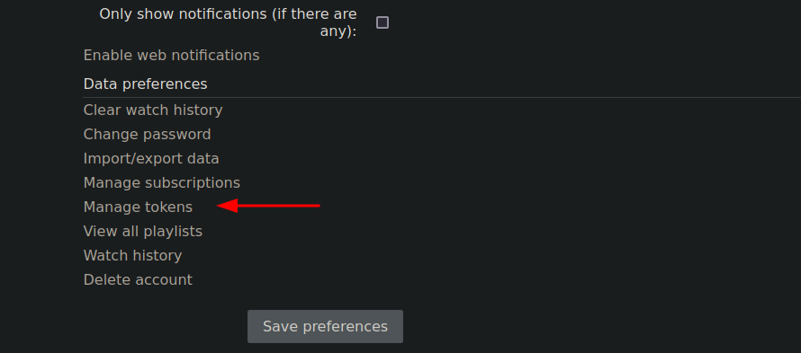
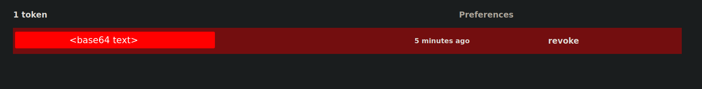
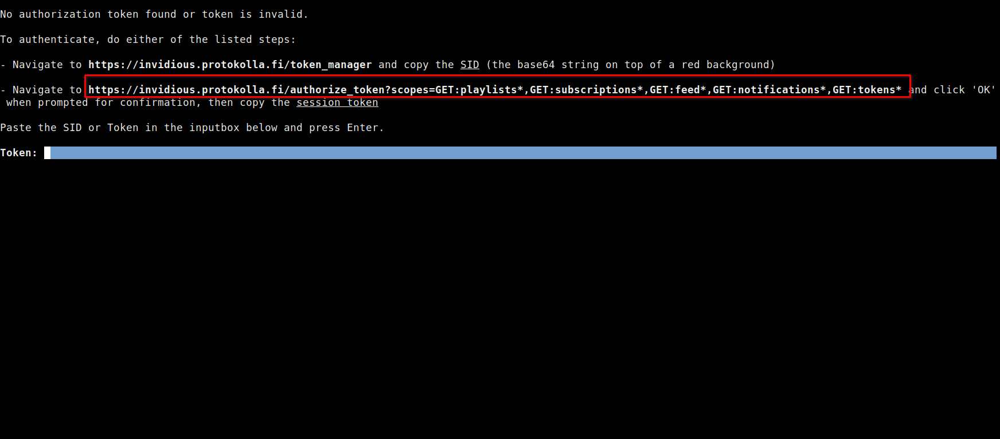
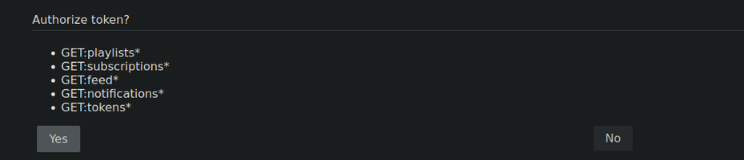
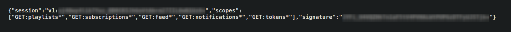
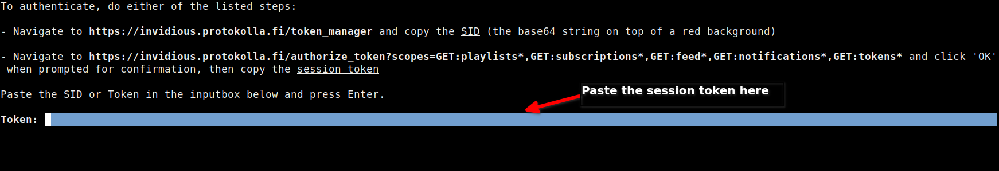

In order to use authentication-based features, like viewing and managing user feed, playlists and subscriptions, an account needs to be registered with a specific Invidious instance.

The following steps should be followed to obtain authentication for an instance:
- Obtain a [user token](#user-token)
- Use invidtui to authenticate

These steps can be performed for multiple invidious instances.

# User Token
For the user token, either a [SID](#sid) or a generated [Session Token](#session-token) can be used.

## SID
This is a base64 encoded text, that is automatically generated when you register an account with an Invidious instance. 

To get your SID:
- Login into your Invidious instance using a web browser<br />
	<br /><br />

- Once you are redirected to the homepage, click on the 'settings' icon<br />
	<br /><br />

- Click on 'Manage tokens'<br />
	<br /><br />
	
- Copy the Base64 encoded text on top of a red background
	

## Session Token
This is is a JSON text, that has to be explicitly generated after verification from the instance.

To get the link to your instance's token manager, either:
- Copy and navigate to the link shown in the dashboard if you are authenticating within invidtui, or ,<br />
	<br /><br />
	
- If authenticating via the command-line, type `invidtui --force-instance <instance name> --token-link`, copy and navigate to the displayed link.
	<br /><br />
	
Once the link has been opened in a web browser:
- After the page loads, press 'Yes' and wait for the page to stop loading.<br />
  	<br /><br />
	
- Copy the session token displayed on the webpage.<br />
	

# Authentication
Once the user token has been obtained, you can finish authentication either within invidtui or via the command line.

## Within InvidTUI
To authenticate within InvidTUI:

- First, launch invidtui with the instance<br/>
```
invidtui --force-instance <instance name>
```

- Once invidtui has initialized, open the [dashboard](03_Usage/02_Keybindings/02_Page_Specific_Keybindings.md#dashboard), paste the user token in the inputbox and press <kbd>`Enter`</kbd>
	

The dashboard should then load the feeds from the authenticated user account.

## Via the Command Line
To authenticate via the command line, type:
```
invidtui --force-instance <instance name> --token <user token>
```

And invidtui should initialize and authenticate the user with the instance.
